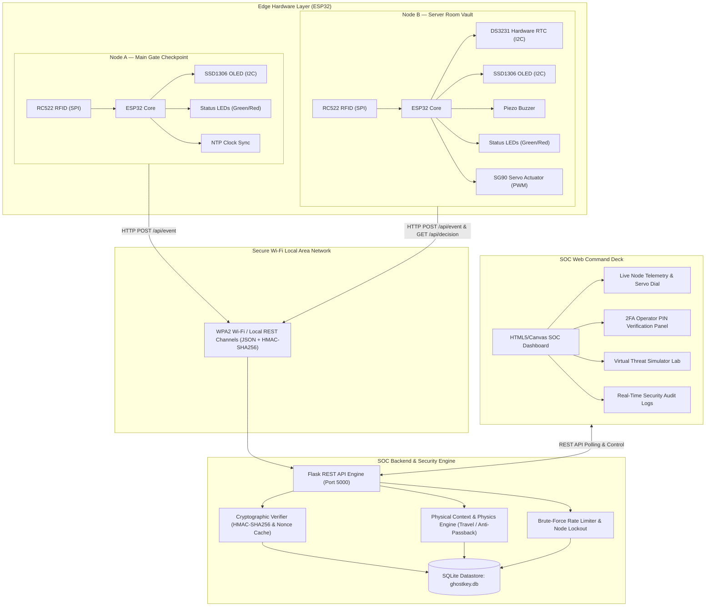
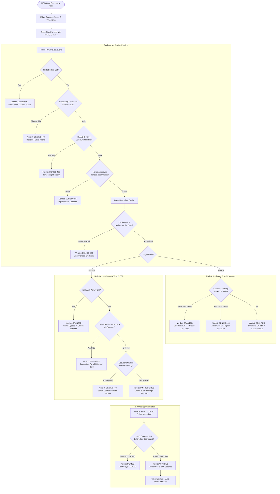
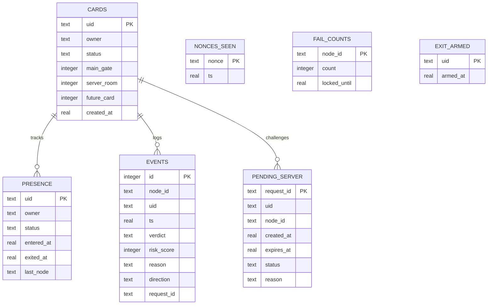

# 🛡️ CYPHER — GHOST KEY (PS04)
### Trust-Aware Dynamic RFID Access-Control & Security Operations Center (SOC)
**Project Kerberos × Amrita Cyber Nation (ACN)**  
**Team:** Cypher | **Track:** Hardware & Network Security (PS04 — The Ghost Key)

---

## 📌 Executive Summary

Traditional RFID access control systems rely on static Unique Identifiers (UIDs) broadcast in plaintext over 13.56 MHz NFC/RFID channels. These systems operate under an implicit and deeply flawed assumption: *that possession of a card equals authorization of the individual*. In reality, modern offensive hardware tools such as Flipper Zero, Proxmark3, and handheld RFID cloners can capture, clone, replay, or relay static card UIDs in milliseconds.

**Cypher Ghost Key** resolves this vulnerability through a **Zero-Trust, context-aware hardware-software access architecture**. The system is built around the competition directive:

> *"Authenticate a person at that door without trusting the thing standing in front of them, and without leaving the door either permanently open or permanently shut."*

By combining **cryptographic challenge-freshness** (HMAC-SHA256 and ephemeral nonces), **physical perimeter context** (anti-passback tracking and impossible travel physics), **hardware Real-Time Clocks (DS3231 RTC)**, **Two-Factor Operator Authentication (2FA)**, and **fail-secure servo-timed actuation**, Cypher Ghost Key prevents credential cloning, replay attacks, signal relaying, brute-force spoofing, and stolen credential abuse.

---

## 🏗️ System Architecture & Block Diagram

The Cypher Ghost Key architecture consists of three interconnected layers:
1. **Physical Hardware Edge Layer:** Microcontroller-driven edge checkpoints (Node A: Main Gate, Node B: Server Room Vault).
2. **SOC Core & Cryptographic Backend:** Flask-based real-time security decision engine backed by an ACID-compliant SQLite datastore.
3. **Cybersecurity Command Deck:** Real-time web-based Security Operations Center (SOC) dashboard featuring telemetry monitors, dynamic servo actuation gauges, 2FA challenge approval, and a virtual threat simulator lab.

### High-Level System Architecture



---

## 🔌 Hardware Pinout & Edge Node Configurations

Both physical checkpoints are powered by **Espressif ESP32** dual-core microcontrollers programmed in C++ using the Arduino framework with hardware cryptographic accelerators (`mbedtls`).

### Hardware Component Matrix

| Component | Node A (Main Gate) | Node B (Server Room) | Purpose / Role |
| :--- | :---: | :---: | :--- |
| **ESP32 DevKit V1** | Yes | Yes | Edge compute, Wi-Fi stack, cryptographic packet signing (`mbedtls`) |
| **RC522 RFID Reader** | Yes (SPI) | Yes (SPI) | High-frequency 13.56 MHz RFID/NFC tag UID detection |
| **SSD1306 0.96" OLED** | Yes (I2C) | Yes (I2C) | Real-time status display, user prompt, and security alerts |
| **DS3231 RTC Module** | No (NTP) | Yes (I2C) | Tamper-resistant hardware real-time clock for packet freshness |
| **SG90 Micro Servo** | No | Yes (GPIO 13) | Physical door locking mechanism (0° Locked, 90° Unlocked) |
| **Active Piezo Buzzer**| No | Yes (GPIO 27) | Auditory alert cues (Success beeps, Warning chirps, Alarm tones) |
| **Green / Red LEDs** | Yes (32 / 33) | Yes (32 / 33) | Visual pass/fail status indicators |

### Pin Configuration Table

```text
=====================================================================================
ESP32 PIN       NODE A (MAIN GATE) FUNCTION       NODE B (SERVER ROOM) FUNCTION
=====================================================================================
GPIO 5          RFID SS / SDA (SPI CS)            RFID SS / SDA (SPI CS)
GPIO 4          RFID RST (Reset)                  RFID RST (Reset)
GPIO 18         RFID SCK (SPI Clock)              RFID SCK (SPI Clock)
GPIO 19         RFID MISO                         RFID MISO
GPIO 23         RFID MOSI                         RFID MOSI
GPIO 21         OLED SDA (I2C Data)               OLED SDA & DS3231 RTC SDA (I2C Data)
GPIO 22         OLED SCL (I2C Clock)              OLED SCL & DS3231 RTC SCL (I2C Clock)
GPIO 13         —                                 Servo PWM Signal Pin
GPIO 27         —                                 Active Buzzer VCC
GPIO 32         Green LED Anode                   Green LED Anode
GPIO 33         Red LED Anode                     Red LED Anode
3V3 / VIN       Power Supply (3.3V / 5V)          Power Supply (3.3V / 5V)
GND             Common Ground                     Common Ground
=====================================================================================
```

---

## 🔒 Security Engine: The 6 Pillars of Defense



### 1. Cryptographic Freshness & Anti-Replay Cache
- **Mechanism:** Every authentication transmission is parameterized with an ephemeral cryptographic nonce (`esp_random() + millis()`) and a Unix timestamp.
- **Defense:** Nonces are recorded in SQLite (`nonces_seen`). Retransmission of captured raw packets is rejected immediately (`replay detected: nonce already consumed`).

### 2. Payload Integrity via HMAC-SHA256
- **Mechanism:** The message string `NODE_ID|UID|TS|NONCE` is cryptographically signed using a pre-shared master secret key using hardware-accelerated `mbedtls` on the ESP32.
- **Defense:** Any tampering with the UID, node identifier, timestamp, or payload bytes results in cryptographic signature rejection.

### 3. Latency & Relay Attack Defense
- **Mechanism:** Packet timestamps (from Node B's DS3231 RTC or Node A's NTP) are validated against backend server time using a strict $\pm 30\text{s}$ freshness window.
- **Defense:** Proxy-based RF relaying setups that introduce transmission latency or delayed replay buffers are dropped as expired packets.

### 4. Anti-Passback & Spatial Presence Tracking
- **Mechanism:** Node A maintains a strict building occupancy model (`presence` table). When a credential enters, the cardholder status becomes `INSIDE`.
- **Defense:** If an attacker attempts to scan the same card or a clone at the Main Gate without an authorized checkout, the security engine triggers an **Anti-Passback Replay Violation** (`verdict: DENIED`, Risk Score: 92). Legitimate exit requires explicit authorization via the SOC dashboard ("Arm Exit").

### 5. Impossible Travel Physics Engine
- **Mechanism:** The system computes the physical travel duration $\Delta t$ between Node A (Main Gate) and Node B (Server Room):
  $$\Delta t = t_{\text{Node B}} - t_{\text{Node A}}$$
- **Defense:** If $\Delta t < 5.0\text{s}$, it is physically impossible for a human being to transit the distance between the checkpoint and the vault. The engine flags an **Impossible Travel Event**, blocking card clones and radio relays instantly (Risk Score: 95).

### 6. Possession Insufficiency & 2FA Operator Challenge
- **Mechanism:** Card possession alone is fundamentally insufficient to enter Node B. Even an authorized badge holder cannot open the server vault by tapping alone.
- **Defense:** Node B generates an ephemeral second-factor challenge (`request_id`). The door servo remains locked at 0° while the edge node polls `/api/decision/<request_id>`. The door only actuates when a SOC operator enters the designated PIN (`2468`) on the dashboard, achieving True Multi-Factor Zero-Trust verification.

### 7. Brute-Force Rate Limiting & Node Lockout
- **Mechanism:** The engine logs consecutive credential failures per node (`fail_counts`).
- **Defense:** After 5 consecutive failures (unknown NFC tags or invalid PINs), the node enters an automatic **30-second hardware lockout**. All subsequent requests are rejected with `HTTP 403` and high-severity SOC alerts until the cooldown expires or an operator issues an administrative reset.

### 8. Fail-Secure Timed Actuation (Zero-Trust Door)
- **Mechanism:** Once granted, the SG90 servo rotates to 90° for exactly **5 seconds** before automatically returning to 0° (locked).
- **Defense:** Resolves the mandate: *"without leaving the door permanently open or permanently shut."*

---

## 🖥️ SOC Command Dashboard

The system includes a production-grade web dashboard served directly by the backend at `http://localhost:5000`:

```text
┌──────────────────────────────────────────────────────────────────────────────────────────────────┐
│  CYPHER  [TEAM CYPHER] [PS04: GHOST KEY]                    ● SOC ENGINE LIVE  [DEFCON 5: NORMAL] │
│  Zero-Trust Dynamic Hardware RFID SOC • Anti-Cloning • Replay Defense • Context-Aware Engine      │
├──────────────────────────────────────────────────────────────────────────────────────────────────┤
│  [ Executive Overview ] [ Node Telemetry ] [ Threat Simulator ] [ Presence ] [ Cards ] [ Logs ]  │
├──────────────────────────────────────────────────────────────────────────────────────────────────┤
│  🚨 WHAT IT DEMANDS                                                                              │
│  "Authenticate a person at that door without trusting the thing standing in front of them,       │
│   and without leaving the door either permanently open or permanently shut."                     │
│  [⚡ DEMO: ZERO-TRUST DOOR AUTHENTICATION]                                                        │
├──────────────────────────────────────────────────┬───────────────────────────────────────────────┤
│  ● NODE A — MAIN GATE               [ONLINE]     │  ● NODE B — SERVER ROOM              [ONLINE] │
│  Brute-Force Rate Limiter: 0 / 5 Failures        │  PHYSICAL SERVO DOOR ACTUATOR: 🔒 LOCKED      │
│  [====================] (Secure)                 │  Servo Dial: [ 0° LOCKED ]    [RTC: 14:32:01] │
│  Last Scan: E2E93719 | GRANTED | ENTRY           │  Vault Brute-Force Tracker: 0 / 5 Failures    │
│  [Scan Card (Entry)]  [⚡ Test Replay]            │  [Simulate Scan (2FA)] [⚡ Test Stolen Card]  │
├──────────────────────────────────────────────────┴───────────────────────────────────────────────┤
│  👥 BUILDING PRESENCE & ANTI-PASSBACK                                                            │
│  UID: E2E93719 | User: Authorized User 1 | Status: ● INSIDE | Action: [🚪 ARM EXIT] [Force Out] │
├──────────────────────────────────────────────────────────────────────────────────────────────────┤
│  ⚡ VIRTUAL ATTACK SIMULATOR LAB                                                                  │
│  [ 1. Replay Attack ]  [ 2. Brute Force (5x) ]  [ 3. Clone / Travel ]  [ 4. Stolen Card ]        │
│  [ 5. Relayed Signal ] [ 6. Valid Entry/Exit ]  [ 7. Zero-Trust Door Auth ]                      │
├──────────────────────────────────────────────────────────────────────────────────────────────────┤
│  📜 LIVE SOC SECURITY EVENT AUDIT LOG (Real-time cryptographic audit trail with risk scoring)    │
└──────────────────────────────────────────────────────────────────────────────────────────────────┘
```

### Dashboard Capabilities:
- **Dual Visual Theme System:** Stealth Dark Mode (SOC theme) and Cyber Cobalt Light Mode.
- **Node Telemetry & Actuator Visualizer:** Real-time servo angle needle display (0° to 90°), live countdown timer, and DS3231 RTC clock reading.
- **Interactive 2FA Alert Modal:** Pops up dynamically when a badge taps Node B, offering operator PIN verification or one-click rejection.
- **Perimeter Presence & Anti-Passback Control:** Real-time occupancy list with an "Arm Exit" trigger.
- **Virtual Threat Simulator:** Execute all 5 real-world attack scenarios and 2 validation flows with one click, outputting raw JSON diagnostic traces.
- **Live Searchable Audit Log:** Filter security logs by verdict (`GRANTED`, `DENIED`), node ID, UID, or free-text keywords with color-coded risk scores.

---

## ⚡ Attack Demonstrations & Verification Suite

The repository includes both an in-process automated Python test suite and dedicated standalone attack simulation scripts in `demo/`:

| Attack Script | Vector Under Test | Attacker Behavior | Defensive Mechanism Activated | Outcome |
| :--- | :--- | :--- | :--- | :--- |
| `demo/attack_replay.py` | **Replay Attack** | Intercepts a valid signed packet and re-transmits it 1s later. | SQLite `nonces_seen` uniqueness constraint. | **BLOCKED (HTTP 403):** Replay detected (nonce already consumed). |
| `demo/attack_clone.py` | **Credential Cloning** | Card scanned at Node A; clone scanned at Node B 1s later. | Spatial context engine ($\Delta t < 5\text{s}$ threshold). | **BLOCKED (HTTP 403):** Impossible travel detected between checkpoints. |
| `demo/attack_bruteforce.py` | **Brute-Force Attack** | Rapidly sends 6 randomized unauthorized NFC tags. | Failure counter increments ($1/5 \to 5/5$). | **BLOCKED (HTTP 403):** Node enters 30s hardware lockout on attempt 5. |
| `demo/attack_stolen_card.py` | **Stolen Badge** | Genuine authorized card presented at Node B without Node A scan. | Building perimeter context check (`presence` table). | **BLOCKED (HTTP 403):** Perimeter bypass detected (cardholder not INSIDE). |
| `demo/attack_relay.py` | **Signal Relaying** | Transmits valid credentials with artificially injected 90s delay. | Timestamp freshness validation ($|t_{\text{now}} - t_{\text{packet}}| > 30\text{s}$). | **BLOCKED (HTTP 403):** Packet rejected as stale/relayed signal. |

---

## 💾 Database Schema (`ghostkey.db`)



---

## 📡 REST API Reference

| Endpoint | Method | Payload / Params | Description |
| :--- | :---: | :--- | :--- |
| `/api/event` | `POST` | `{"node_id", "uid", "ts", "nonce", "sig", "direction"}` | Primary RFID event ingest endpoint for ESP32 nodes and simulators. |
| `/api/decision/<request_id>` | `GET` | URL param `request_id` | Polling endpoint for Node B ESP32 to query door unlock verdict after 2FA. |
| `/api/server/verify` | `POST` | `{"request_id", "pin"}` | Operator PIN verification endpoint for Node B access requests. |
| `/api/server/reject` | `POST` | `{"request_id"}` | Manually reject a pending Server Room access request. |
| `/api/exit/arm` | `POST` | `{"uid"}` | Arm exit for an occupant at Node A (resolves anti-passback). |
| `/api/exit/force` | `POST` | `{"uid"}` | Administrative manual checkout override for an occupant. |
| `/api/cards` | `GET / POST` | Card registry schema | Retrieve all credentials or provision a new card with access scopes. |
| `/api/cards/<uid>` | `DELETE` | URL param `uid` | Revoke a card credential immediately. |
| `/api/cards/<uid>/activate`| `POST` | URL param `uid` | Re-activate a revoked credential. |
| `/api/nodes` | `GET` | None | Retrieve real-time telemetry, failure counters, lockout timers, and servo state. |
| `/api/nodes/<node_id>/reset`| `POST` | URL param `node_id` | Clear brute-force failure counts and lift active hardware lockouts. |
| `/api/presence` | `GET` | None | Retrieve active building perimeter occupants and exit-arming states. |
| `/api/pending` | `GET` | None | Retrieve pending 2FA Server Room authorization challenges. |
| `/api/logs` | `GET` | None | Retrieve chronological security audit trail (last 150 events). |
| `/api/logs/clear` | `POST` | None | Clear all security event logs from the database. |
| `/api/virtual-attack/<type>`| `POST` | `replay`, `bruteforce`, `clone`, `stolen`, `relay`, `zero_trust_door` | Execute an in-process attack simulation and return forensic JSON output. |

---

## 🚀 Installation & Quick Start Guide

### 1. Prerequisites
- **Python:** 3.10+ (Tested on Python 3.12 / 3.14)
- **Microcontrollers (Optional for hardware deployment):** 2× ESP32 DevKit V1 boards with Arduino IDE 2.x
- **Libraries for ESP32:** `MFRC522`, `Adafruit SSD1306`, `Adafruit GFX`, `RTClib`, `ESP32Servo`, `ArduinoJson` (v6)

### 2. Backend & Dashboard Setup
```bash
# Clone repository and navigate to backend
cd Ghost_Key/Cypher_GhostKey

# Install Python requirements
pip install -r requirements.txt

# Start SOC Backend Server
python backend/app.py
```
*The server will initialize the SQLite database, register default cards (`E2E93719`, `031459AD`), and expose the SOC dashboard at `http://localhost:5000`.*

### 3. Run Automated Security Verification Suite
Verify all cryptographic assertions, impossible travel physics, replay caches, rate limits, and 2FA flows without physical hardware:
```bash
python firmware/tests/test_suite.py
```

### 4. Running Standalone Attack Simulations
With `backend/app.py` running in a separate terminal:
```bash
# Test Replay Defense
python demo/attack_replay.py

# Test Clone & Impossible Travel Detection
python demo/attack_clone.py

# Test Brute Force Rate Limiting & Lockout
python demo/attack_bruteforce.py

# Test Stolen Card Perimeter Bypass Defense
python demo/attack_stolen_card.py

# Test Signal Relay & Latency Rejection
python demo/attack_relay.py
```

### 5. Flashing Edge Microcontrollers (ESP32)
1. Open `firmware/node_a/node_a.ino` and `firmware/node_b/node_b.ino` in Arduino IDE.
2. In `config.h` for each node, configure your local Wi-Fi SSID, password, and the IP address of the machine running `app.py`:
   ```cpp
   #define WIFI_SSID "POCO M6 Pro 5G"
   #define WIFI_PASS "123456789"
   #define SERVER_URL "http://192.168.x.x:5000/api/event"
   ```
3. Ensure `SHARED_SECRET` in both `config.h` files matches `backend/config_secret.py`.
4. Connect each ESP32 via USB and upload the respective sketch.

---

## 🏆 Project Accomplishments & Competition Summary

1. **Hardware Implementation:** Complete firmware for dual ESP32 nodes interfacing with RFID readers, I2C OLED displays, DS3231 RTC, SG90 servo motor, and indicator buzzers/LEDs.
2. **True Zero-Trust Security Pipeline:** Cryptographic HMAC-SHA256 signature verification and single-use nonce tracking eliminates credential cloning and replay vulnerabilities.
3. **Context & Physics-Aware Defenses:** Spatial presence tracking and impossible travel rate calculations defeat stolen cards and multi-point clone attacks.
4. **Failsafe Mechanical Actuation:** Dynamic 5-second servo unlock window solves the core mandate without leaving perimeter doors permanently open or shut.
5. **Interactive SOC Dashboard:** Full-featured command center enabling real-time perimeter monitoring, operator 2FA PIN verification, card management, and attack simulations.
6. **Extensive Attack Verification:** Five automated simulation modules proving system resilience against replay, clone, relay, brute-force, and perimeter bypass threats.

---
*Developed by Team Cypher for Project Kerberos × Amrita Cyber Nation.*
